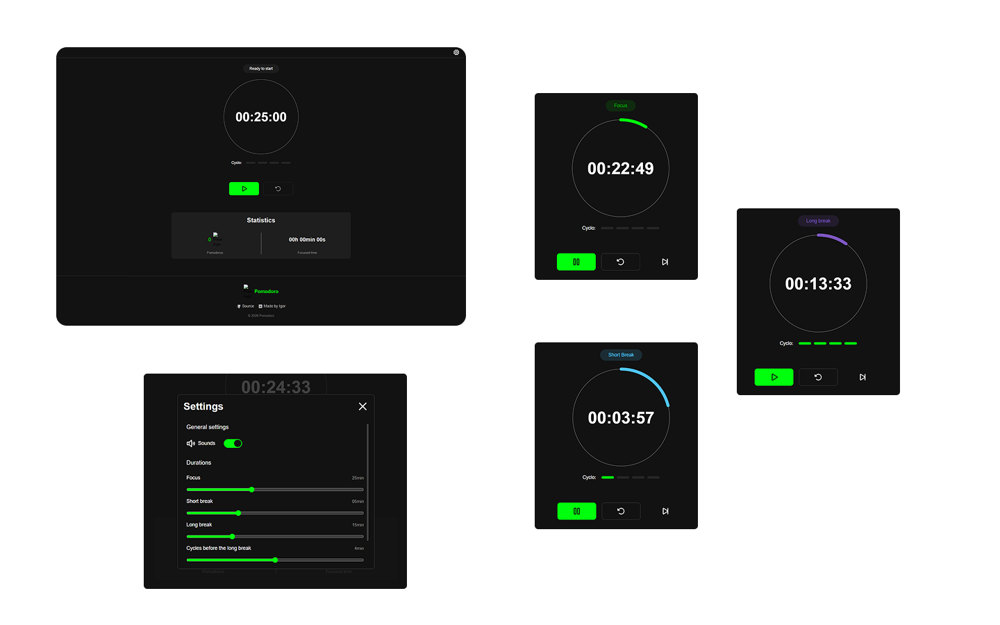

# Pomodoro

A Pomodoro timer to organize tasks, stay focused, and boost productivity.

# Preview

## Live Demo

Access the [Live Demo](https://pomodoro-igor-chaves-demo.vercel.app/) or copy the URL directly: `https://pomodoro-igor-chaves-demo.vercel.app/`

## Cover



# Resources

## Features

- Start, pause, and reset a session
- Automatic switching between Focus, Short Break, and Long Break modes
- Configurable durations for Focus, Short Break, and Long Break
- Customizable number of cycles before a Long Break
- Enable or disable sound notifications
- Track total Pomodoros completed and total focus time
- Display current session status and remaining time
- Persist settings and stats with LocalStorage
- Offline support with PWA

## Technologies

- HTML
- Sass
- JavaScript, TypeScript
- ReactJS, Vite
- React Router
- Zustand

## Development support

- Git
- NPM
- EditorConfig, ESLint, and Prettier
- Lighthouse, PageSpeed Insights

## Extras

- Responsive UI
- Mobile First
- BEM Methodology
- Absolute imports
- SEO
- Deploy on Vercel

# How to use

## Installation

```bash
git clone https://github.com/igorchaves22/pomodoro.git
cd pomodoro
npm install
```

## Running the Project

```bash
npm run dev
```
